# Chart Cyanvas / A sekai custom charts platform
[](https://github.com/sevenc-nanashi/chart_cyanvas/actions/workflows/frontend-check.yml) [](https://github.com/sevenc-nanashi/chart_cyanvas/actions/workflows/backend-check.yml) [](https://github.com/sevenc-nanashi/chart_cyanvas/actions/workflows/sub-audio-check.yml) [](https://github.com/sevenc-nanashi/chart_cyanvas/actions/workflows/sub-image-check.yml) [](https://github.com/sevenc-nanashi/chart_cyanvas/actions/workflows/sub-sus-check.yml) [](https://discord.gg/2NP3U3r8Rz)

Chart Cyanvas is a sekai custom charts platform.

> **Warning**
> This project is still in development!

## Architecture



- `frontend/` - Frontend. Built with Next.js and Tailwind CSS.
- `backend/` - Backend. Built with Rails.
- `sub-audio/` - Audio processing. Built with Python, FastApi and ffmpeg.
- `sub-image/` - Image processing. Built with Python, FastAPI and Pillow.
- `sub-sus/` - SUS processing. Built with TypeScript, express, and [sonolus-pjsekai-engine-extended](https://github.com/sevenc-nanashi/sonolus-pjsekai-engine-extended).

## Hosting
1. Copy `.env.prod.example` to `.env`
2. Fill `.env`
3. `docker compose -f docker-compose.prod.yml --profile prod up -d`

## Development

### Requirements

- `make`
- [Ruby 3.2](https://ruby-lang.org)
  - [Bundler](https://bundler.io)
- [Python 3.9](https://python.org)
  - [Poetry](https://python-poetry.org/)
    - [poethepoet](https://github.com/nat-n/poethepoet) as a Poetry plugin
- [Node.js 16](https://nodejs.org)
  - [pnpm](https://pnpm.io)
- [Docker](https://www.docker.com/)
- [`goreman` CLI](https://github.com/mattn/goreman)

### Install dependencies

```
make install
```

### Start external server for development

```
docker compose --profile dev up -d
```

### Start all development server

```
goreman start
```

## License

This project is licensed under the GPLv3 License.
