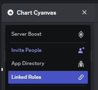

# Publishing a chart

## 1. Create a Sonolus account

Create an account from the Sonolus main menu.

## 2. Register your Sonolus account with Chart Cyanvas

Click the "Log in" button in the top right corner and a QR code will be displayed. After scanning with your device with Sonolus installed, return to the Chart Cyanvas page to log in.

## 3. Link your Discord account

Join Discord from the sidebar and get the role from the linked role menu.

## 4. Create a chart

We recommend [MikuMikuWorld for Chart Cyanvas](https://github.com/sevenc-nanashi/MikuMikuWorld4cc).

## 5. Upload your chart

Click your username in the top right corner and click "Post chart".

## 6. Test your chart

Log in to the server and select "Private" from "Levels" -> "Advanced".

## 7. Edit your chart

Click your username in the top right corner and click "My charts". Then click the chart you want to edit and click "Edit".

Uploading a file and pressing the "Update" button will update the chart.

## 8. Publish your chart

Once you have tested your chart and it is complete, change the publication settings from the edit screen and press the publish button.
