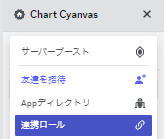

# 譜面公開

## 1. Sonolus のアカウントを作成する

Sonolus のメインメニューからアカウントを作成して下さい。

## 2. Sonolus のアカウントを Chart Cyanvas に登録する

右上の「ログイン」ボタンを押すと QR コードが表示されます。Sonolus が入っている端末でスキャンした後、Chart Cyanvas のページに戻るとログインできます。

## 3. Discord のアカウントを連携する

サイドバーから Discord に入り、連携ロールメニューからロールを取得して下さい。

## 4. 譜面を作成する

[MikuMikuWorld for Chart Cyanvas](https://github.com/sevenc-nanashi/MikuMikuWorld4cc) を推奨します。

## 5. 譜面を投稿する

右上のユーザー名をクリックして、譜面投稿をクリックしてください。

## 6. 譜面をテストする

サーバーにログインし、「レベル」 -> 「高度」から「非公開」を選んで下さい。

## 7. 譜面を編集する

右上のユーザー名をクリックして、「自分の譜面」をクリックしてください。 その後、編集したい譜面をクリックし、編集をクリックしてください。

ファイルをアップロードして「更新」ボタンを押すと更新されます。

## 8. 譜面を公開する

テストして譜面が完成したら、編集画面から公開設定を変更し、公開ボタンを押してください。
